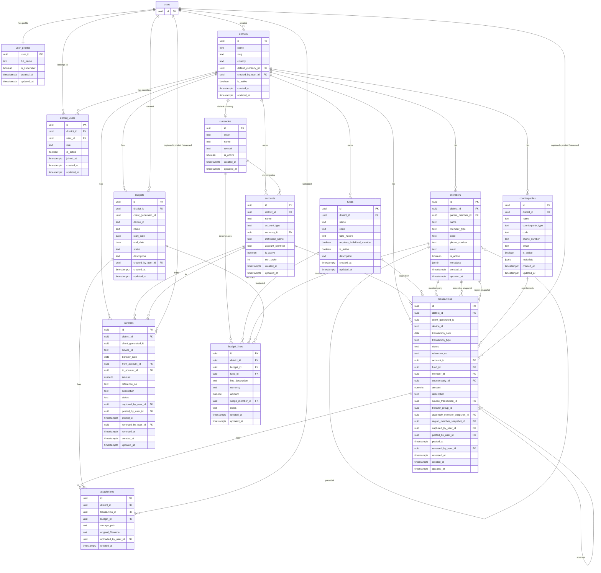

# District Finance Dashboard

A multi-tenant finance dashboard built with Next.js and Supabase for tracking district income, expenditure, and statement exports.

## What It Does

- Record income transactions per district
- Record expenditure transactions per district
- Manage reusable income and expenditure categories
- Switch between all-district and single-district views as an admin
- Export income and expenditure statements as CSV, DOCX, and PDF
- Import districts, income, and expenditure from CSV

## Roles

| Role | Access |
|------|--------|
| `admin` | View all districts, switch scope, manage imports, manage districts |
| `district` | View and manage finance data for their own district |

Authentication is handled with Supabase Auth. Route protection is enforced for all `/dashboard/*` paths.

## Tech Stack

- Next.js 16 App Router
- React 19
- Supabase (PostgreSQL + Auth)
- Tailwind CSS 4
- `docx` for Word statement exports
- `@react-pdf/renderer` for PDF statement exports

## Getting Started

### Prerequisites

- Node.js 18+
- A dedicated Supabase project for this finance app

### Install

```bash
npm install
```

### Environment Variables

Create `.env.local` in the project root:

```env
NEXT_PUBLIC_SUPABASE_URL=https://your-project.supabase.co
NEXT_PUBLIC_SUPABASE_ANON_KEY=your-anon-key
SUPABASE_SERVICE_ROLE_KEY=your-service-role-key

# Optional
NEXT_PUBLIC_REGISTRATION_ENABLED=false
```

`SUPABASE_SERVICE_ROLE_KEY` is server-only and must never be exposed to the browser.

### Run the App

```bash
npm run dev
```

Open `http://localhost:3000`.

## Main Routes

- `/dashboard/overview`
- `/dashboard/finance/expenditure`
- `/dashboard/finance/income`
- `/dashboard/finance/reports`
- `/dashboard/settings`

## Supported API Endpoints

- `POST /api/auth/register`
- `POST /api/import/districts`
- `POST /api/import/income`
- `POST /api/import/expenses`
- `GET /api/reports/ie-docx`
- `GET /api/reports/ie-pdf`
- `GET /api/routes`

## Database Schema

### Entity Relationship Diagram



### Core Tables

| Table | Purpose |
|-------|---------|
| `users` | Supabase Auth identities |
| `user_profiles` | Platform-level metadata; `is_superuser` grants cross-district access |
| `districts` | Tenant boundary — every district-owned record carries `district_id` |
| `district_users` | Maps users to districts with district-level roles (admin, treasurer, auditor, …) |
| `currencies` | Global currency catalogue (USD, ZWG, ZAR, …) |
| `accounts` | Cash, bank, and mobile-money accounts per district |
| `funds` | Financial classification buckets (tithes, offerings, welfare, …) |
| `members` | Church hierarchy tree: district → region → assembly → individual / department |
| `counterparties` | External parties — suppliers and other payees |
| `transactions` | Receipts, payments, adjustments, and reversals; immutable once posted |
| `transfers` | Logical transfer objects that generate paired effect rows on posting |
| `budgets` | Expense budget containers (draft → active → closed) |
| `budget_lines` | Planned expense targets identified by fund, line description, currency, and optional member scope |
| `attachments` | Files linked to transactions or budgets |

### Transaction Lifecycle

```
DRAFT → POSTED → REVERSED
DRAFT → VOID_DRAFT
```

Posted transactions are immutable. Corrections must go through a `REVERSAL` transaction that references the original via `source_transaction_id`.

### Transfer Lifecycle

On posting a transfer, the system generates two linked transaction effect rows — one `TRANSFER_OUT` and one `TRANSFER_IN` — sharing the same `transfer_group_id`. Transfers do not count as income or expense in fund reporting.

### Member Hierarchy

```
DISTRICT
  └── REGION
        └── ASSEMBLY
              └── INDIVIDUAL
  └── DEPARTMENT (may attach to district, region, or assembly)
```

When a tithe transaction is posted against an `INDIVIDUAL` member, the system derives and snapshots `assembly_member_snapshot_id` and `region_member_snapshot_id` so historical reports remain correct even after hierarchy changes.

### Key Enums

| Field | Allowed Values |
|-------|----------------|
| `account_type` | `BANK`, `MOBILE_MONEY`, `CASH`, `DEPOSIT_HOLDING`, `OTHER` |
| `fund_nature` | `INCOME`, `EXPENSE`, `BOTH` |
| `member_type` | `DISTRICT`, `REGION`, `ASSEMBLY`, `INDIVIDUAL`, `DEPARTMENT` |
| `counterparty_type` | `SUPPLIER`, `OTHER` |
| `transaction_type` | `RECEIPT`, `PAYMENT`, `TRANSFER_IN`, `TRANSFER_OUT`, `ADJUSTMENT_IN`, `ADJUSTMENT_OUT`, `REVERSAL` |
| `transaction_status` | `DRAFT`, `POSTED`, `REVERSED`, `VOID_DRAFT` |
| `transfer_status` | `DRAFT`, `POSTED`, `REVERSED`, `VOID_DRAFT` |
| `budget_status` | `DRAFT`, `ACTIVE`, `CLOSED` |
| `district_user_role` | `DISTRICT_ADMIN`, `DISTRICT_SECRETARY`, `TREASURER`, `AUDITOR`, `VIEWER` |

Conference-specific tables and mobile content APIs are intentionally out of scope for this product.

## Scripts

```bash
npm run dev
npm run build
npm run start
npm run lint
npm run seed:admin
```
